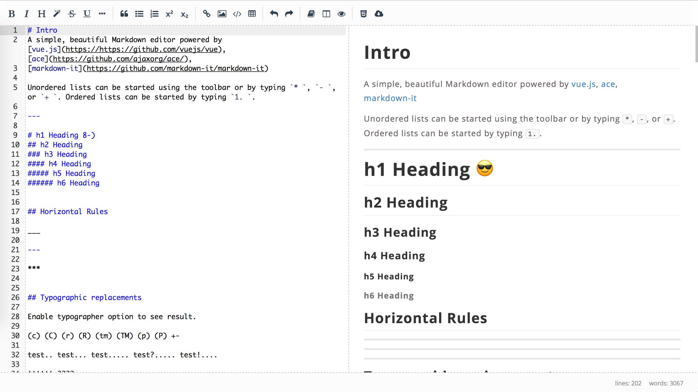

# Menote
A simple, beautiful Markdown editor powered by [vue.js](https://https://github.com/vuejs/vue), [ace](https://github.com/ajaxorg/ace/),
[markdown-it](https://github.com/markdown-it/markdown-it)

## Screenshot


## Build Setup

``` bash
# install dependencies
npm install or yarn install

# serve with hot reload at localhost:8080
npm run dev

# build for production with minification
npm run build

# build for production and view the bundle analyzer report
npm run build --report
```
